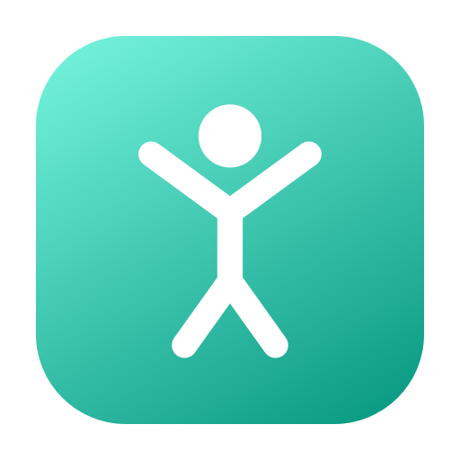
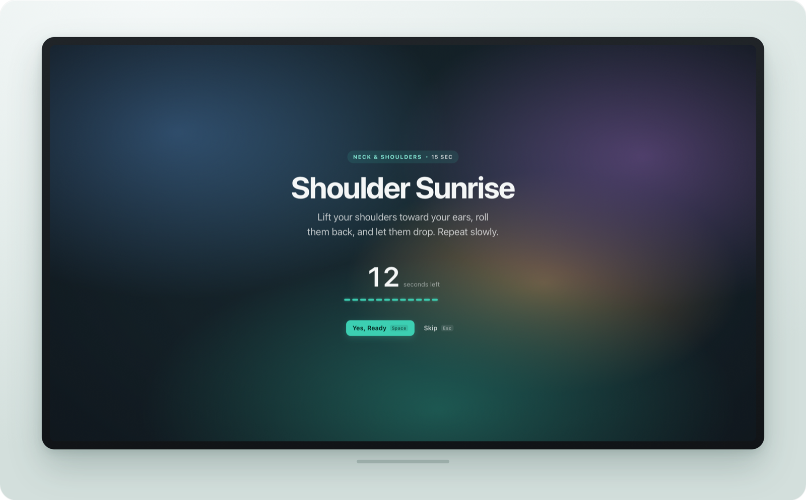
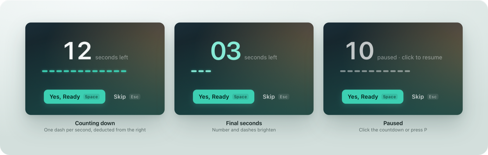
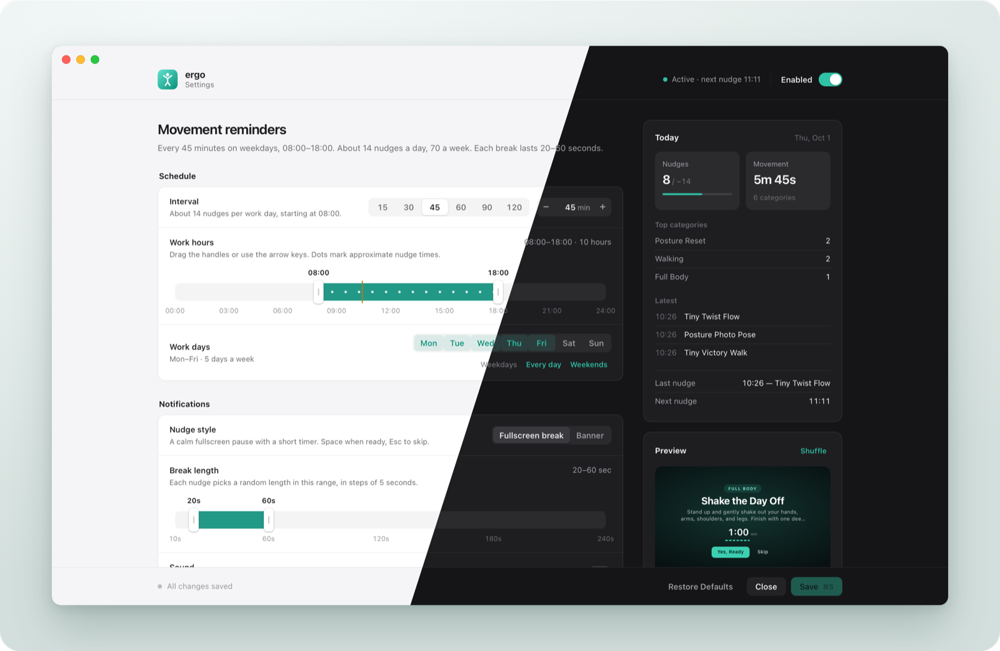
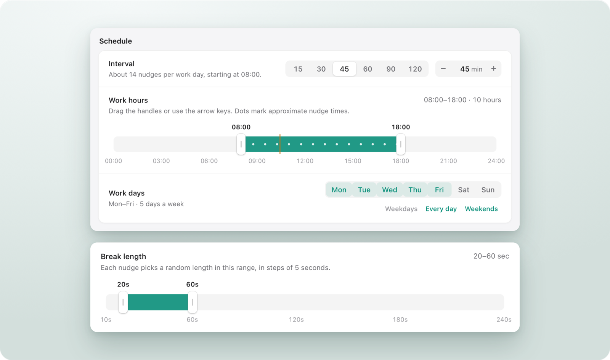
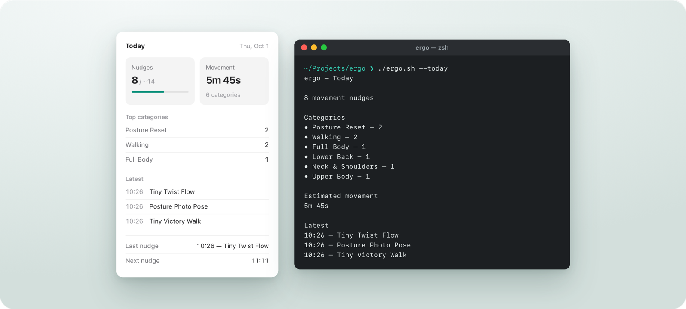
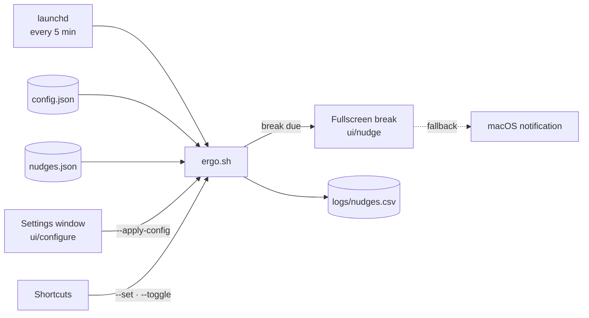

<p align="center">
  
</p>

<h1 align="center">ergo</h1>

<p align="center">
  Scheduled movement breaks for macOS — native, private, and dependency-light.
</p>

<p align="center">
  
  
  
  
  
</p>

<p align="center">
  <a href="#overview">Overview</a> ·
  <a href="#feature-tour">Feature tour</a> ·
  <a href="#architecture">Architecture</a> ·
  <a href="#getting-started">Getting started</a> ·
  <a href="SETUP.md">Documentation</a>
</p>

<p align="center">
  
</p>

## Overview

ergo is a lightweight posture and movement companion for macOS. During the
working hours you define, it interrupts at a steady interval with one short,
specific movement — a shoulder roll, a distance gaze, a few steps — presented as
a calm fullscreen break with a countdown. It then steps aside until the next one.

It is built entirely on components that ship with macOS — `zsh`, `launchd`,
`osascript` and WebKit — plus `jq`. There is no application bundle, no account,
no background service of its own, and no network access.

## Key features

| | |
|---|---|
| **Fullscreen breaks** | A blurred overlay on every display, with the break on the active screen. Appears instantly, works over fullscreen apps, never switches Spaces. |
| **Precise countdown** | Two-digit timer with a dashed progress line that deducts one dash per second. Pause with a click or `P`; finish with `Space`; skip with `Esc`. |
| **Variable break length** | Each break draws a random length from a configurable 10–240 second range, in 5-second steps. |
| **Smart cue selection** | Avoids recent repeats, varies categories, and weights movements by time of day. |
| **Schedule control** | Interval, working hours, working days, a master switch, and a quiet mode for meetings and presentations. |
| **Native settings window** | Light and dark appearance, a visual timeline for working hours, a break-length range slider, and live daily statistics. |
| **Automation** | A complete command-line interface and optional macOS Shortcuts for menu-bar control. |
| **Resilient by design** | Validated, atomically written configuration; automatic fallback to a standard notification; no runaway or stuck states. |

## Feature tour

### The break

<p align="center">
  
</p>

Each break shows the movement's category, title and a one-line instruction,
followed by the countdown. One dash is deducted per second, in step with the
number; the final three seconds are highlighted so the end is visible at a
glance. An unattended break closes itself after 15 minutes, and `Esc` always
dismisses it immediately.

### The settings window

<p align="center">
  
</p>

A native window organised like System Settings: grouped panels, labels on the
left, controls on the right, and a summary column with today's activity and a
live preview. A plain-language sentence at the top restates the active schedule —
for example, *“Every 45 minutes on weekdays, 08:00–18:00. About 14 nudges a day.”*

### Scheduling

<p align="center">
  
</p>

Working hours are set by dragging handles along a 24-hour timeline, with markers
showing approximately when each break will occur. Break length is a range rather
than a fixed value, so consecutive breaks vary naturally.

### Daily insights

<p align="center">
  
</p>

Daily progress is available in the settings window and from the terminal:
breaks taken against the day's estimate, estimated movement time, the most
frequent categories, and the most recent breaks. Every break is recorded locally
in a CSV log with its outcome and actual length.

## Architecture



| Component | Responsibility |
|---|---|
| `launchd` agent | Wakes ergo every five minutes; no long-running process. |
| `ergo.sh` | Scheduling decisions, cue selection, logging, state, and the command-line interface. |
| `ui/nudge.*` | Fullscreen break: a WebKit page hosted in a borderless overlay through `osascript`'s JavaScript bridge. |
| `ui/configure.*` | Settings window: a WebKit page whose changes are applied only through `ergo.sh --apply-config`. |
| `config.json` · `nudges.json` | Settings and the cue library, as plain, validated JSON. |

Scheduling is evaluated on every wake-up — enabled, quiet mode, working day,
working hours, and elapsed interval — so configuration changes take effect within
minutes without reloading `launchd`. A 60-second tolerance prevents breaks from
drifting with timer jitter. Configuration and state writes go through a
temporary file, are validated with `jq`, and are then renamed into place, so a
partially written file cannot occur. A lock prevents overlapping runs.

## Getting started

```bash
cd /path/to/ergo
chmod +x ergo.sh
./ergo.sh --test          # show a break immediately
./ergo.sh --configure     # open the settings window
```

To run ergo automatically at login, install the included LaunchAgent. Complete
instructions — installation, the LaunchAgent, configuration reference, Shortcuts,
logs and troubleshooting — are in **[SETUP.md](SETUP.md)**.

### Requirements

| | |
|---|---|
| Operating system | macOS. Developed and tested on macOS 26. |
| Dependency | `jq` — included with macOS 15 Sequoia and later at `/usr/bin/jq`. |
| Permissions | Allow the LaunchAgent as a background item. Banner notifications (optional, and the fallback) appear under *Script Editor* in Notification settings. |

## Privacy and security

- All data remains on the device: settings in `config.json`, history in
  `logs/nudges.csv`, state in `state/`.
- No network requests, analytics or telemetry. Both interface pages enforce a
  content security policy that blocks network access.
- No access to the clipboard, camera, microphone, contacts or Health data.
- The interface pages never write files directly; every change is validated by
  `ergo.sh` before it is saved.

## Roadmap

- Automatically defer breaks while the screen is being shared.
- Weekly summary alongside the daily view.
- Optional per-cue illustrations on the break screen.
- Import and export of cue libraries.

## FAQ

**Can breaks be paused for meetings or presentations?**
Yes. Quiet mode suspends scheduled breaks while leaving manual breaks available.
Enable it from the settings window, a Shortcut, or `./ergo.sh --set quiet on`.

**Is a standard notification available instead of the fullscreen break?**
Yes. Select **Banner** under *Nudge style*, or run
`./ergo.sh --set style notification`.

**Can the movements be customised?**
Yes. The cue library is `nudges.json`; each cue is a short JSON object with a
title, an instruction and a category. `./ergo.sh --status` validates the file.

**Does ergo require an internet connection or an account?**
No. It operates entirely offline and has no sign-in.

## Contributing

Issues and pull requests are welcome. The engine is a single shell script
(`ergo.sh`) and the interfaces are self-contained pages in `ui/`. Please keep
external dependencies limited to `jq`. The project layout is documented in
[SETUP.md](SETUP.md#13-project-layout).

## Disclaimer

ergo provides general movement reminders and is not a medical device or a
substitute for professional advice. If a movement causes pain, stop and consult a
qualified professional.
